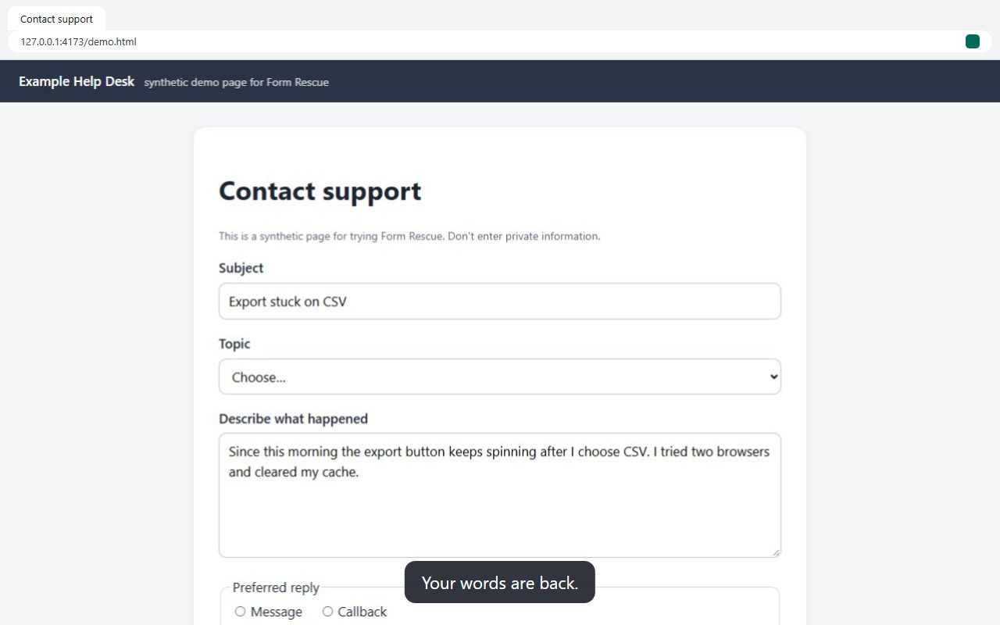

<p align="center">
  
</p>

<h1 align="center">Form Rescue</h1>

<p align="center"><strong>Get your words back.</strong> A local, open-source browser extension that saves drafts on the sites you choose and lets you recover them after a refresh, a closed tab, a crash or an expired sign-in.</p>

<p align="center">
  
  
</p>

<p align="center">
  <a href="assets/recordings/recovery.webm">
    
  </a>
  <br>
  <sub>Website: <a href="https://form-rescue.vercel.app">form-rescue.vercel.app</a> · <a href="assets/recordings/recovery.webm">Watch the 30-second recording</a> (real extension, synthetic test page, <a href="assets/recordings/recovery.vtt">captions</a>).</sub>
</p>

Long answers, support requests and applications get lost when a page refreshes, navigates, signs you out or fails. Form Rescue is a small safety net: turn it on for a site, write as usual, and if the page lets you down, review what was saved and restore the fields you pick. Drafts stay in your browser profile — no account, no server, no telemetry.

**Maturity: alpha.** Everything below is implemented and tested on synthetic pages; it is distributed as a developer build, not through browser stores. See [docs/implementation-status.md](docs/implementation-status.md).

[Install (developer build)](#install-the-developer-build) · [Website docs](apps/website/src/pages/docs/) · [Demo](apps/website/src/pages/demo.astro) · [Privacy](docs/privacy.md) · [Issues](.github/ISSUE_TEMPLATE/) · [License](LICENSE)

> Source: https://github.com/darkaimzzz/Form-Rescue. The website is deployed on Vercel (see [Deploying the website](#deploying-the-website)).

## Features

- **Opt-in per site.** Access is requested for one scheme + host, only when you click _Enable protection for this site_.
- **Saves what you edit** in text areas, text inputs, non-sensitive dropdowns, checkboxes and radio groups — including forms added after load, common React/Vue forms, open shadow DOM and fields outside `<form>`. Search boxes only if you opt them in.
- **Honest save status.** "Saved locally at …" appears only after the database transaction commits.
- **Review before restoring.** An extension-owned page shows saved and current values side by side. Nothing is restored automatically; existing text is only replaced when you choose _Replace_.
- **Conservative matching.** If a field can't be matched with confidence, you get a _Copy_ button, not a guess. Conflicts are detected at restore time, and _Undo this restore_ is available.
- **Local draft library** with filters, copy, per-draft and per-site deletion. Two tabs never merge.
- **Control:** global pause, 1/7/30-day retention (7 default), field exclusion, disable site (delete drafts by default).

## Limitations

- The newest ~1 second of typing can be lost if the browser crashes or the power fails.
- Not supported: rich-text/`contenteditable` editors, iframes, file uploads, closed shadow roots, private windows, mobile browsers, Safari.
- Restores field content only — not logins, server state, attachments or submissions.
- Local storage isn't a backup: uninstalling, clearing browser data or losing the profile deletes drafts.

## Getting started

1. **Enable a site** from the toolbar button.
2. **Write as usual.** Wait for _Saved locally_.
3. **Review and recover** from _Review drafts_ after a refresh, closed tab or sign-in.

### Install the developer build

Form Rescue isn't in the browser stores. Download `form-rescue-<version>-chrome.zip` (Chrome/Edge) or `form-rescue-<version>-firefox.zip` from the [latest release](https://github.com/darkaimzzz/Form-Rescue/releases/latest) and unzip it, or build it (see [contributor quick start](#contributor-quick-start)). Then:

- **Chrome:** `chrome://extensions` → Developer mode → _Load unpacked_ → `apps/extension/dist/chrome`.
- **Edge:** `edge://extensions` → Developer mode → _Load unpacked_ → `apps/extension/dist/chrome`.
- **Firefox:** `about:debugging#/runtime/this-firefox` → _Load Temporary Add-on_ → `apps/extension/dist/firefox/manifest.json`.

Firefox temporary add-ons (and their drafts) are removed when Firefox restarts. Unpacked Chromium extensions break if their folder moves.

## Privacy

- Drafts are stored only in this browser profile (extension IndexedDB). Nothing is transmitted; there are no analytics, crash reports or remote configuration.
- Sensitive fields — passwords, one-time codes, payment, bank and identity fields, and whole forms containing them — are excluded from metadata before any value is read. Values are also screened for obvious secrets. **These are heuristics:** private prose typed into an ordinary field can still be saved.
- **No application-level encryption.** Anyone who can use your browser profile can read drafts.
- Drafts expire (7 days by default) and can be deleted per draft, per site or all at once. Uninstalling deletes everything.

Full details: [docs/privacy.md](docs/privacy.md) and [docs/threat-model.md](docs/threat-model.md).

## Permissions

| Permission               | Why                                                                   |
| ------------------------ | --------------------------------------------------------------------- |
| `storage`                | Presentation preferences and install state (drafts live in IndexedDB) |
| `scripting`              | Register/inject the packaged capture script on enabled sites only     |
| `activeTab`              | Read the current tab's address when you click the toolbar button      |
| `alarms`                 | Opportunistic clean-up of expired drafts                              |
| optional `http(s)://*/*` | Requested one scheme + host at a time when you enable a site          |

No `<all_urls>`, `tabs`, `history`, `cookies`, `webRequest`, clipboard reading or `unlimitedStorage`. See [docs/permissions.md](docs/permissions.md).

## Browser support

| Browser                 | Tested version | Evidence                       | Status      |
| ----------------------- | -------------- | ------------------------------ | ----------- |
| Chromium (Playwright)   | 153.0.8010.12  | Full automated suite           | Passing     |
| Microsoft Edge          | 153.0.4234.48  | Full automated suite           | Passing     |
| Firefox                 | 156.0.1        | Automated WebDriver BiDi smoke | Passing     |
| Google Chrome (branded) | 153            | Manual check                   | **Pending** |

Windows 11 only so far. Details and evidence: [docs/browser-support.md](docs/browser-support.md).

## Contributor quick start

Prerequisites: Node.js 24 LTS (`.nvmrc`), pnpm 12 (`packageManager`).

```sh
pnpm install --frozen-lockfile
npx playwright install chromium     # for browser tests
pnpm build                          # → apps/extension/dist/{chrome,firefox}, apps/website/dist
pnpm test                           # unit tests + coverage gate
pnpm test:integration               # IndexedDB repository
pnpm test:e2e:chrome                # real extension in Chromium (E2E_CHANNEL=msedge for Edge)
pnpm test:firefox                   # real Firefox smoke (needs installed Firefox)
pnpm fixtures                       # synthetic pages at http://127.0.0.1:4173/
```

Try the demo fixture: run `pnpm fixtures`, load the developer build, open `http://127.0.0.1:4173/demo.html`, enable protection, type, refresh, _Review drafts_.

Read [CONTRIBUTING.md](CONTRIBUTING.md) before opening a PR. Only synthetic data belongs in fixtures, screenshots and issues.

## Architecture

```
apps/extension   MV3 extension: background (authorization, commits, matching), isolated content script,
                 React pages (popup, recovery, library, settings, onboarding)
apps/website     Astro static site and docs
packages/core    pure logic: classification, schemas, identity, matching, retention
packages/storage IndexedDB repository (atomic commits, epochs, limits, migrations)
tests            unit, integration, real-extension E2E, accessibility, Firefox BiDi smoke, fixtures
```

See [docs/architecture.md](docs/architecture.md) and [docs/data-model.md](docs/data-model.md).

## Roadmap

- **Next (P1):** plain-text `contenteditable` recovery, same-origin frames (with a security review), more framework adapters, translations, optional encrypted export/import.
- **Not planned (P2):** accounts, sync, servers, telemetry, AI features, password/payment recovery, automatic restore or submission, mobile/Safari/private-mode support.

## Deploying the website

The site deploys to Vercel from `vercel.json` (pnpm 12 install, `apps/website/dist` output). Production deployments take their canonical origin from Vercel's production domain; preview deployments are `noindex`. Set `PUBLIC_SITE_ORIGIN` in Vercel to use a custom domain, and `PUBLIC_*_STORE_URL` once store listings are approved.

## Support, security and license

- Questions and bugs: GitHub issue forms (never include real drafts, passwords or private URLs).
- Security: report privately as described in [SECURITY.md](SECURITY.md).
- License: [MIT](LICENSE). Third-party notices: [docs/third-party-notices.md](docs/third-party-notices.md). The license grants no rights to third-party trademarks.
